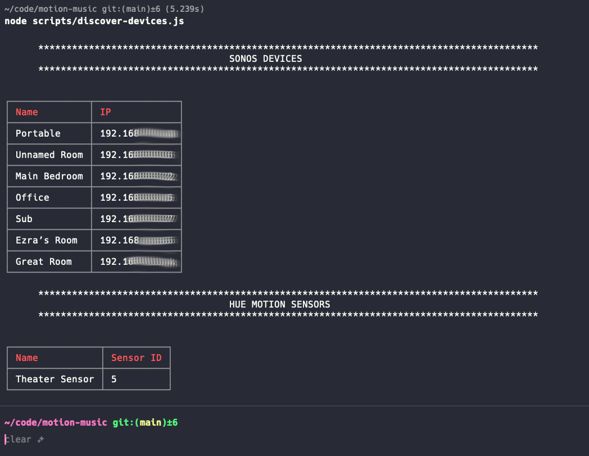

# Groove Sensor 


<p align="center">
  
</p>

To hook this up, you'll need a Sonos speaker hooked up to your wifi and a Hue Philips motion sensor. To get the motion sensor working you'll also need a Hue Philips bridge and motion sensor setup. Both the Hue and Sonos systems should be connected to the same wifi network. This app runs locally on your network, so it's not really meant to run indefinitely unless you have maybe a dedicated box or run this in a container in the background. I don't plan on doing that, but if you want to make a PR to enable that, I'd welcome the contribution. Lastly, I recommend syncing your Spotify and Sonos accounts. More on Spotify below.

## Spotify
The tracks in the track list found in `src/lib/config.js` are Spotify URIs. Based on the Sonos JS library, this can also be an arbitrary MP3 file. I'm sure there are other options as well, but I haven't tested any of them. The working assumption is that your Sonos and Spotify accounts are linked and that you're using Spotify URIs. The integration between those services is pretty good and I recommend connecting them regardless of what you do with this software.

## Helper Scripts and Setup
### Sonos Devices
There's a script in `scripts/discover-devices.js` which will list all of the Sonos speakers and their internal IP address so you don't have to dig through the app to get them. The app will automatically discover your Sonos devices and let you choose a speaker when you launch it, so this data is purely informational in that you don't need to do anything with it. When the discovery happens, the app builds a Sonos configuration object which has the IP and name.

### Hue Devices
For the Hue motion sensors, you'll need to know your bridge IP and username ahead of time. I tried to do a discover option but it doesn't seem to work for me. It's possible the library isn't compatible with the version of the software my bridge is running. I will not dig into this. You can find your bridge's IP by heading into the settings section of the official Hue Philips control app. Next, store the bridge's IP as an environment variable `HUE_BRIDGE_IP`. Then, create a new user. You do this by:

1. Pressing the button on your Hue bridge
2. Running this code (ensure you're connected to the same network as the bridge)

```javascript
const jsHue = require('jshue');
const bridge = hue.bridge(process.env.HUE_BRIDGE_IP);
const hue = jsHue();

bridge.createUser('myApp#testdevice').then(data => {
  // extract bridge-generated username from returned data
  const username = data[0].success.username;
  console.log('New username:', username);
});
```

3. Take the username generated above and store it as an environment variable `HUE_USERNAME`.
4. Whichever motion sensor you use, you'll need to store its ID as `HUE_SENSOR_ID` so the app knows which motion sensor to poll.

The result should be something like this:




## Configuration

| Environment Variable    | Type    | Description                                        | Required | Default |
| :---------------------- | :------ | :------------------------------------------------- | :------: | :-----: |
| SONOS_DISCOVERY_TIMEOUT | Number  | Timeout (seconds) for the device discovery process | No       | `5`     |
| HUE_BRIDGE_IP           | String  | IP Address of your Hugh Philips bridge device      | Yes      ||
| HUE_USERNAME            | String  | Newly created username to connect to the bridge    | Yes      ||
| HUE_SENSOR_ID           | String  | Device ID for the target Hue motion sensor         | Yes      ||
| HUE_MOTION_STOP_BUFFER  | Number  | How long to wait (seconds) after motion stops to emit the `motion_stop` event | No |`90`|
| HUE_MOTION_POLLING_INTERVAL | Number  | How long to wait (seconds) in between sensor state polls | No |`2`|

### Why Does This Exist?

I have a newly rentovated guest bathroom in my home. The plan is to setup a motion detector and put a sonos speaker in there. When someone enters the bathroom to handle business, they'll hear music based on a "vibe" (most likely hits from the 80s, sorry kids!) I've chosen ahead of time.